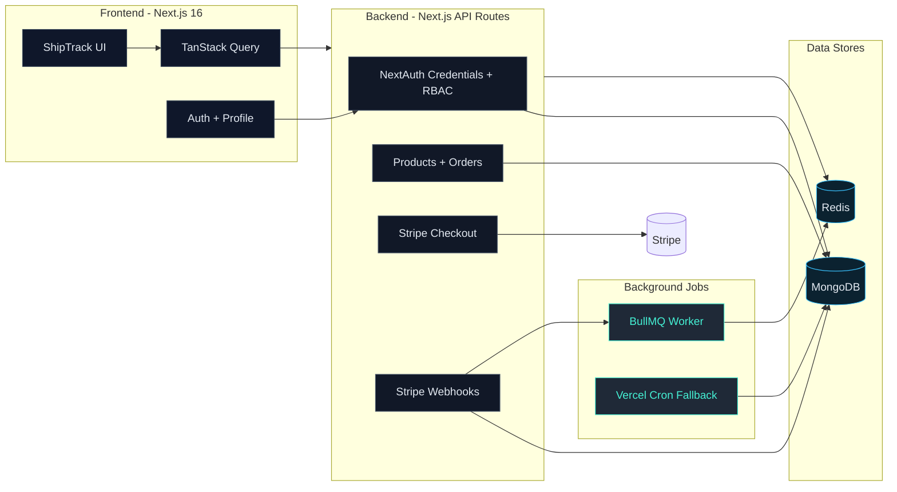

# ShipTrack — Full-Stack Logistics Commerce App

ShipTrack is a production-style e-commerce logistics application built to showcase modern full-stack skills: Next.js 16 App Router, MongoDB/Mongoose, NextAuth credentials auth, Stripe Checkout + webhooks, BullMQ + Redis background jobs, and a futuristic UI built with Tailwind.

## Live Demo

- Demo: <ADD-LIVE-DEMO-URL>

## Features

- Customer catalog, product detail, cart, Stripe checkout, order history
- Admin control center: orders, products CRUD, analytics
- Secure auth with JWT sessions and role-based access control
- Stripe webhooks for payment confirmation
- BullMQ queue worker for emails + automated fulfillment
- Vercel cron fallback to fulfill paid orders without a worker

## Tech Stack

- Next.js 16 (App Router)
- MongoDB + Mongoose
- NextAuth.js (Credentials provider)
- Stripe Checkout + Webhooks
- BullMQ + Redis
- Tailwind CSS + TanStack Query

## Project Structure

All application logic is in `apps/web`:

```
apps/web/
  app/            # Routes, layouts, API handlers
  lib/            # DB connection, auth, helpers
  db/             # Mongoose models
  jobs/           # BullMQ worker
  scripts/        # Seed script
  ui/             # Shared UI components
  types/          # Shared types
```

## Setup

1) Install dependencies

```
npm install
```

2) Create `.env.local` in `apps/web` (see required variables below).

3) Seed demo data

```
npm run seed -w apps/web
```

4) Run the app

```
npm run dev -w apps/web
```

Optional: run the worker locally for BullMQ jobs

```
npm run worker -w apps/web
```

## Environment Variables

Create `apps/web/.env.local` with:

```
MONGODB_URI=
MONGODB_DB=shiptrack
NEXTAUTH_SECRET=
NEXTAUTH_URL=http://localhost:3000

STRIPE_SECRET_KEY=
NEXT_PUBLIC_STRIPE_PUBLISHABLE_KEY=
STRIPE_WEBHOOK_SECRET=
STRIPE_DISABLED=false

REDIS_URL=
```

## Deployment (Vercel)

ShipTrack is configured for Vercel-only deployment. BullMQ workers cannot run on serverless functions, so there are two fulfillment paths:

1) **Primary**: run the worker on a separate process (local, VM, or container)
2) **Fallback**: Vercel cron hits `/api/cron/fulfill` every 5 minutes to mark paid orders as delivered

Set all environment variables in Vercel and register your Stripe webhook URL to:

```
https://<your-domain>/api/stripe/webhook
```

## Demo Accounts

After seeding:

- Admin: `admin@shiptrack.io` / `admin123`
- Customer: `customer1@shiptrack.io` / `password`

## Scripts

- `npm run dev -w apps/web` — start dev server
- `npm run build -w apps/web` — production build
- `npm run seed -w apps/web` — seed demo data
- `npm run worker -w apps/web` — run BullMQ worker

## Screenshots

Add screenshots under `apps/web/public/screenshots/` and reference them here:

- `apps/web/public/screenshots/home.png` — Home / Mission Control
- `apps/web/public/screenshots/catalog.png` — Product Catalog
- `apps/web/public/screenshots/admin-orders.png` — Admin Orders

Replace filenames or add more as needed.

## Architecture Diagram



## Architecture Notes

ShipTrack uses the Next.js App Router with server components for data-heavy pages, client components for interactive experiences (cart, auth). Stripe webhooks update order states, then enqueue BullMQ jobs for fulfillment and email. If the worker is not running, the Vercel cron fallback ensures paid orders still progress.

### Stripe unavailable?

If Stripe signup is not available in your country, set `STRIPE_DISABLED=true` in `apps/web/.env.local`. Checkout will run in demo mode and automatically mark orders as paid.
